# Interpreting the greater than capability in GPT-2 Small (recreation and extension of Hanna et. al 2023)

Language models as old as GPT-2 have demonstrated many interesting capabilities, including the ability to compute certain mathematical tasks. In order to understand these largely blackboxed machines, it is a natural question to ask how language models carry out such computations within their internals. This post will detail my procedures and findings as I aim to recreate the findings made by Hanna et. al in their paper "How does GPT-2 compute greater-than?".

All of my experiments were run on GPT-2 Small, loaded through the TransformerLens library written by Neel Nanda. 

GPT-2 Small is really bad at math. Asking it to evaluate even simple expressions proves to be a difficult task. But there are implicit mathematical tasks encoded in the natural language text that the model is trained on. In the original Hanna et. al paper, the researchers use prompts written in a natural language setting that force the model to try and predict a number larger than some comparison number. An example pulled directly from the paper is the next token prediction of: "The war lasted from the year 1732 to the year 17". By studying how such prompts are processed internally, we can build an understanding of how GPT-2 Small computes greater than. The work in this blog post will focus on identifying the circuit in GPT-2 Small which computes greater than.

Limited by compute and time, there were some simplifications that we had to make to keep the scope of the project reasonable to execute. For example, while the paper studied prompts of the form "The [noun] lasted from the year YYXX to the year YY", sampling [noun] from a word bank and YY from the set {11, ..., 17}, we will use a fixed prompt: "The war lasted from the year 18XX to the year 18". XX is a two digit value in {01, ..., 99} which allows us to measure the model's performance on a range of year spans within our prompt. (Why 18? Well, I naively wanted to be slightly different from the paper, but years beginning with 18 should also fall well within the context of the prompt).

The first Week of this project was spent focused on building a general understanding of what components are important for the greater than computation. We do so in a few ways: logit lens visualization, ablation tests, and attention pattern analysis.

A logit lens is a mechanistic interpretability technique used to visualize how a model's prediction develops throughout its layers. It is computed by applying the final projection layer of the output at a hidden layer to get a sort of premature logits (hence the name). We compute the logit lens across every XX prompt at once to measure the model's behavior on the task as a whole. Once a model's layer is successfully computing greater than, we would expect to see diagonal structure emerge in that layer's logit lens to illustrate the model's predictions favoring predicted tokens which are greater than XX. Notably, by plotting the logit lens for every layer in GPT-2 Small, we see diagonal structure faintly emerging as early as layer 5, and solidifies by layer 9.

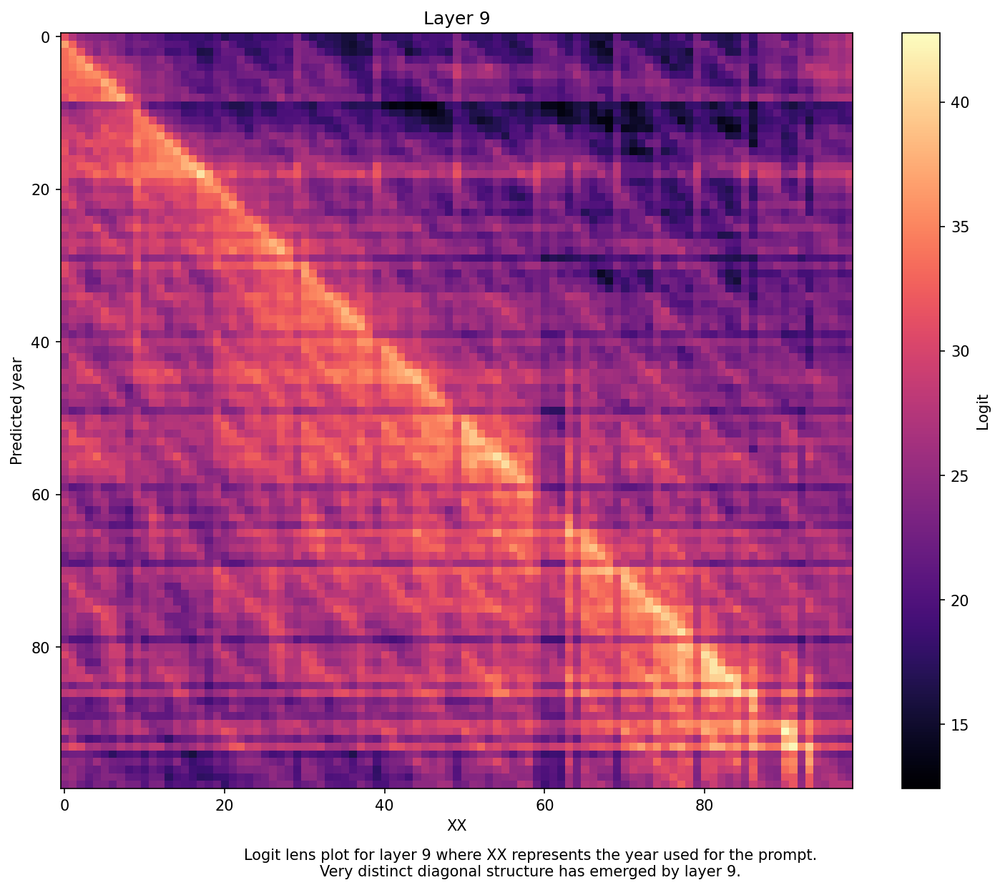

The development of diagonal structure beginning in layer 5 suggests that all layers after and including layer 5 should be contributing to the greater than computation.

Naturally, we want to investigate further. Knowing which layers seem important is still not convincing enough; we want to get specific. Although the paper jumps directly into path patching, ablation tests are a much simpler route to start off with.

We run ablation tests on two things: the model's attention layers, and the model's components. Ablating the layers provide more evidence supporting the developing hypothesis that the later layers compute greater than, and ablating components allows us to narrow down which specific internals are necessary. Our metric of comparison will be the binary accuracy of the model, computed across all 99 instances of XX. A prediction is correct if the predicted token is greater than XX (it is also fair to argue that predictions equal to XX should count, but to keep our methodology clear, we opt for strictly greater than). The baseline accuracy is 94 correct out of 99.

Considering GPT-2 Small's 144 attention heads and 12 MLPs as components, we run ablation tests on the attention layers by zeroing their outputs. Interestingly, ablating the attention outputs does not yield a significant decrease in accuracy in most layers. Only ablating layers 0 and 9 cause a significant drop in binary accuracy. Since our logit lens indicates that the layers 5 through 8 should aid in computing greater than but the attention ablation tests do not reveal any notable drops in performance, we suspect that the attention outputs of these layers must be indirectly contributing to the circuit.

Next we run ablation tests on individual components. Measuring the changes in model accuracy, we find that l0.h10 and l9.h1 must be important to the greater than with ablated accuracies of 18 out of 99 and 90 out of 99 respectively. Interestingly, the role of layer 0 seems localized to l0.h10 at first glance, but ablating every head except for l0.h10 causes accuracy to plummet to zero. For efficacy, assume that layer 0 as a whole is a key player in the circuit.

We find much more interesting results when ablating the MLPs. This in itself is a fundamental result - the greater than circuit is MLP dependent. Ablating MLPs 0, 9, and 10 independently yields accuracies of 0, 77, and 88 respectively out of 99 prompts. 

Unsurprisingly, the components of layer 0 are a necessity for the greater than circuit. Early layers tend to process foundational information by attending to positional information, first/last token, etc. It is also clear that MLP 9 must handle most of the heavy lifting in the greater than computation as its ablated accuracy is the lowest of all of the MLP ablations. 

Inspired by our previous results suggesting that attention layers 5 through 8 indirectly contribute to the greater than computation, we try ablating attention layers 7 and 8 together with MLP 9. These layers actually interact superadditively, with the model accuracy dropping to 58 out of 99, as opposed to the baseline 77 out of 99 when ablating just MLP 9. We will look deeper into the role of upstream MLPs later in the project, but for now keep in mind that the circuit relies on some kind of interaction between the MLPs.

Finally, to conclude our week one investigation, we look at some attention heads to gather a big picture understanding of what individual components are contributing to the circuit. From this, a pattern emerges: heads that lead to a drop in performance when ablated typically attended to the XX token, and a large portion of heads attended exclusively to the <endoftext> token. As a result, we suspect that information in the residual stream is cumulated in the <endoftext> token and that heads processing the XX token are vital for our circuit.

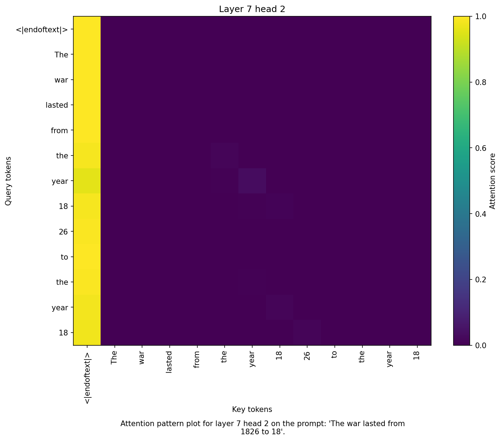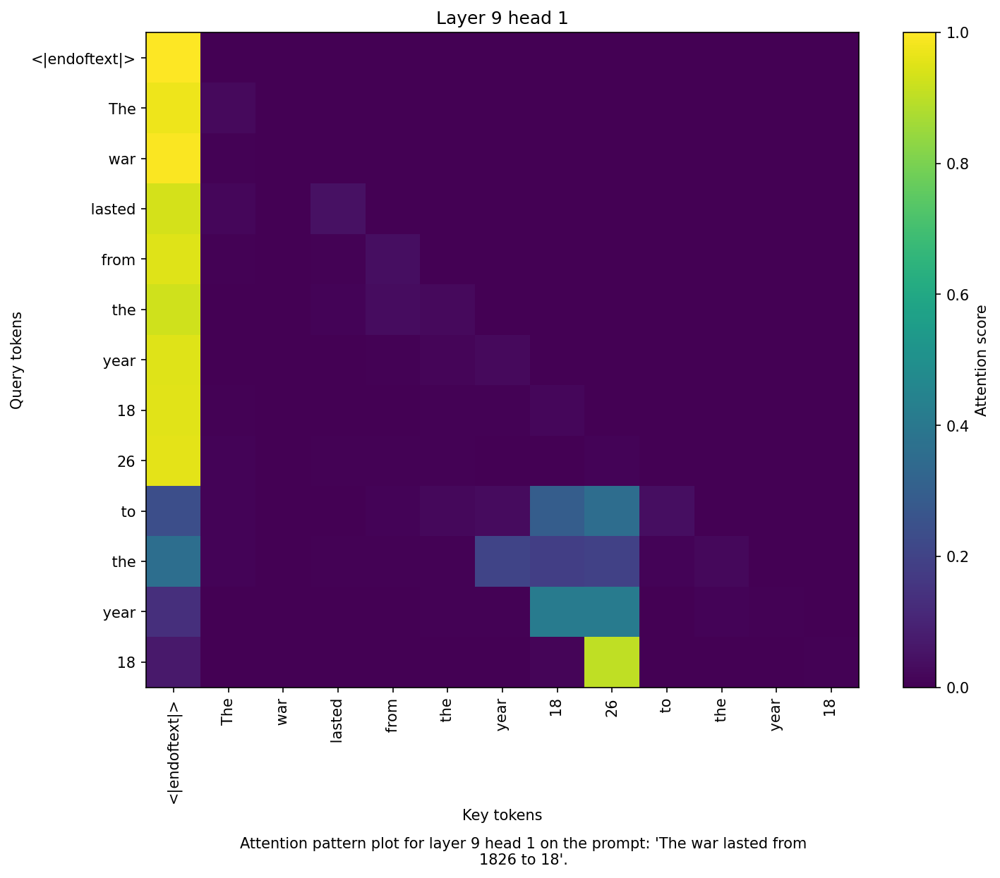

Looking back on what we've done in week one, we now have a better idea of how our model computes greater than. Specific layers and components propagate useful information into the later MLPs which carry out the computation. Funnily, this first week took many iterations to finally get correct. Halfway through, I realized that I had formatted my prompts incorrectly (I was using "The war lasted from 18XX to 18"), and on top of this, I had forgotten to extend one digit numbers to fit the XX format. It was after making these corrections that I finally arrived at these results. Cool, sure. But we still don't know HOW the model is propogating information at each layer- only where information is moving. 

Still with many unanswered questions, we proceed into the main focus of the project. 

Path patching is a technique where you inject a corrupted output of a component along a specific edge in the model's computational graph to measure the importance of that specific edge. 

That's a bit wordy and hard to understand. Let's think less abstractly. When accumulating the residual stream of the model, we throw the residual stream into a component, and use the output of that component (attention layer or MLP) and add it back into the residual stream. So if you think of the residual stream as the sum of all these aggregated components, you realize that the output of a component contributes to the residual stream in a number of ways: most obviously, directly through its output, but also through the contributions in the residual stream that get passed into downstream components.

Now when we path patch, we pick a specific relationship, say the output of layer 5 attention head 6 through MLP 10, and measure this relationship's importance by replacing the clean relationship output with a corrupted one. The notation we use to indicate such a path is (component, component, ..., logits) to map out the order in which we traverse the model's internals to reach the logits.

Furthermore, since we are investigating the model at a lower level now, we must change our unit of accuracy. Before we used binary accuracy, which is a very polarizing metric and doesn't reflect more subtle changes in the model internals. Following the paper's procedures, we instead calculate the difference between the probability the model predicts greater than XX and the probability the model predicts less than or equal to XX. This is done by summing the softmax probabilities from 01, 02, ..., XX, and XX+1, XX+2, ..., 99 and taking their difference, then normalizing by the probability space defined by the predictions 01, 02, ..., 99 (we don't care about other token predictions). If this difference is below zero, then the model's performance decreased.

Another change to keep in mind is that fact that certain prompts (depending on how 18XX gets tokenized), may get tokenized into less or more tokens than others. We found that majority of the prompts got tokenized into 16 tokens, so our remaining experiments will be run on these so-called long prompts (this allows us to compute the probability difference by patching with our corrupted prompt choice below).

The obvious starting place is to patch (component, logits) to see which components directly contribute to the model's prediction. Our corrupted output will be the outputs derived from an inference done on the prompt "The war lasted from the year 1801 to the year 18". We use a corrupted prompt with a low start year (1801) so that patching with its activations should shift the model toward predicting years greater than 01 rather than the clean prompt's XX. The results of this path patching are below:

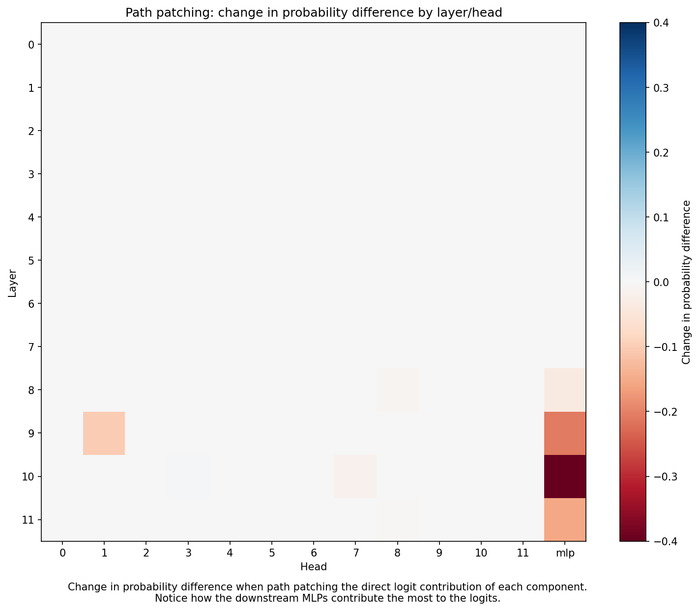

Immediately our hypothesis that the circuit is MLP dependent is confirmed, with MLPs 8, 9, 10, and 11 all leading to a noticable drop in performance. From here, we want to investigate how upstream components process information through these important MLPs, so next we path patching through (component, MLP Y, logits) where Y=8, 9, 10, or 11.

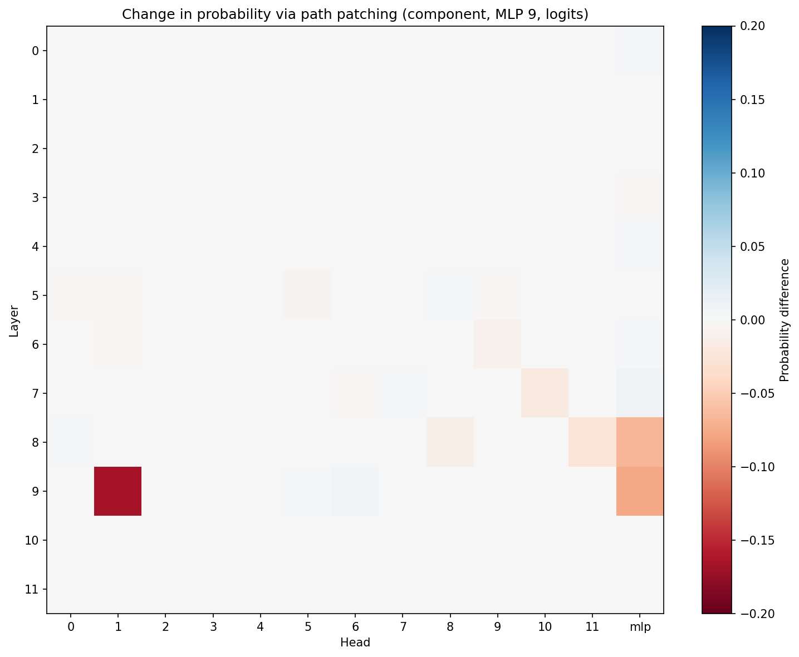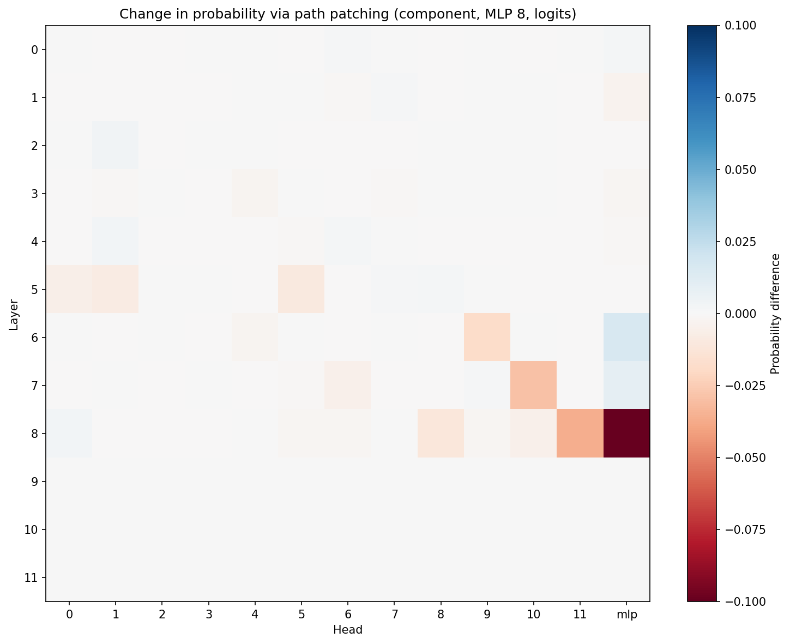

Beginning with MLP 11, since it is the most downstream, we find that it is largely dependent on the MLPs upstream from it. Continuing upstream, we find MLP 10 also depends on upstream MLPs, and that MLP 9 depends heavily on l9.h1. Finally, path patching through MLP 8 we see l5.h1, l5.h5, l6.h9, l7.h10, l8.h8, and l8.h11 all contribute to the circuit through MLP 8. All of these components will be considered a part of our circuit.

With the circuit components identified, we can perform our complete attention head analysis. Upon inspection, we see that l5.h1 and l5.h5 attend almost entirely to the and the year tokens, suggesting that this is a starting point for when the model begins to process the year information used in the greater than computation. This pattern remains true when looking at l6.h9 and l7.h10. Again, both of l8.h8 and l8.h11 attend to the token and the year tokens, just in a much more clear manner. 

The behavior of these significant heads implies that the greater than computation relies heavily on attending to the XX token, which is expected since that is the comparison value used in the computation. Furthermore, since these heads are distributed across multiple layers, it makes sense that our week one layerwise ablation tests didn not destroy the model's performance immediately.

Now we have a complete idea of what components and through what paths our circuit computes greater than through. The upstream attention heads feed relevant information through MLPs 8 and 9, which in turn continue to propagate information downstream via the later MLPs which carry out the greater than task.

With that, we have essentially completed the paper recreation! In fact, our circuit identification results are nearly identical to the original paper's, the only difference being that they isolated and evaluated the circuit's performance on different prompts.

With the bulk of the hard work behind us, we look to see how we can extend beyond the paper's contributions. First, we note that the model underperforms on prompts that tokenize 18XX into a single token. We suspect it is because the model struggles to process the information encoded in the year as a whole and realize it must only compare the XX digits. Intuitively, it makes sense that predictions on a four digit number are harder to conduct than a two digit numbers. Hence, this outlines one pitfall of the model.

Furthermore, in their generalizability section, they note that one new prompt format required the additions of an extra MLP and two new attention heads to the circuit. Here we investigate which components need to be added, and try to piece together why.

First we rerun the path patching experiments on the prompt format "1599, 1607, 1633, 1679, 17XX, 17", the prompt which lead to these changes. The direct logit contribution heatmap looks very similar to our week two results on the original prompt format, with the possibility of the addition of l11.h8.

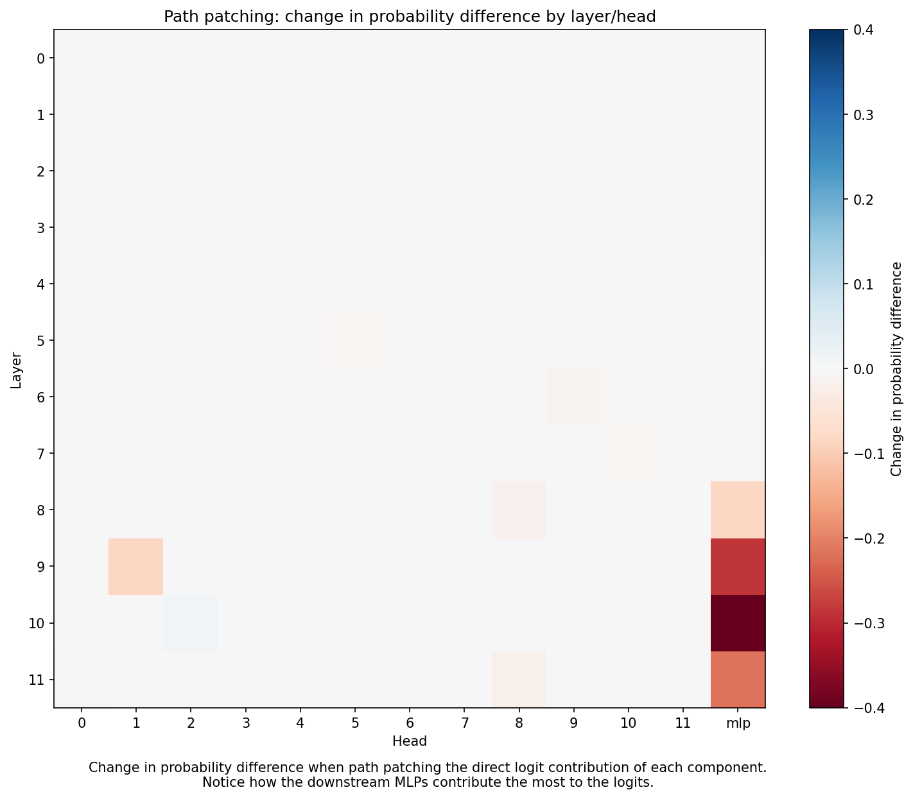

Now we move forward with iterative path patching through the late MLP layers. Notably, patching through MLP 10 reveals that l10.h2 and l10.h4 could also be new additions to our circuit. Closer inspections to their respective attention patterns reveals an interesting pattern among these three heads. They all closely attend to the thousands and hundreds place of the years, implying that these attention heads are what process the sequential pattern in our prompt.

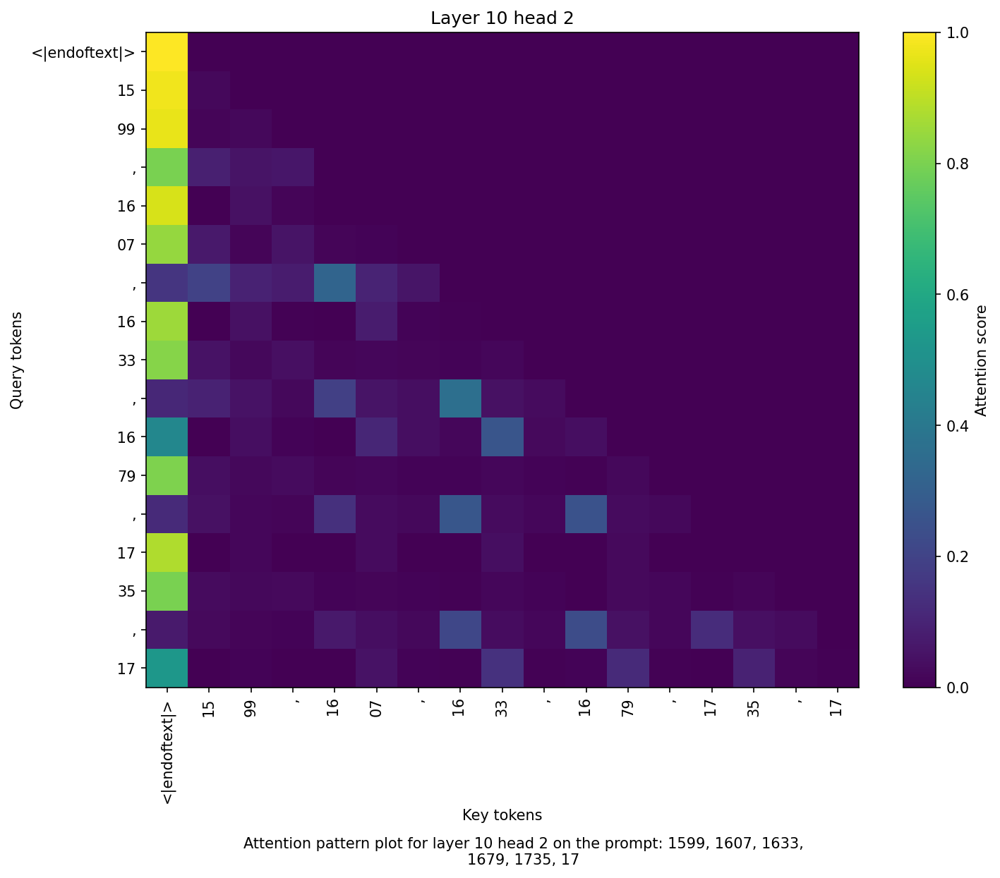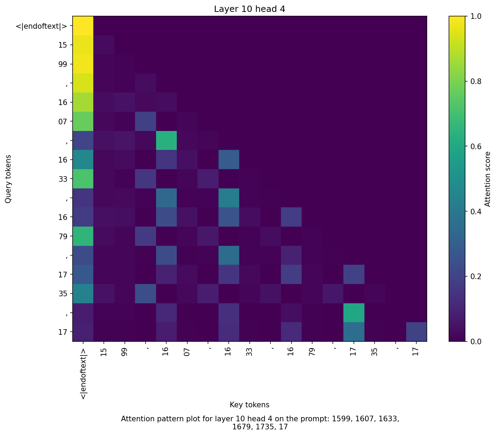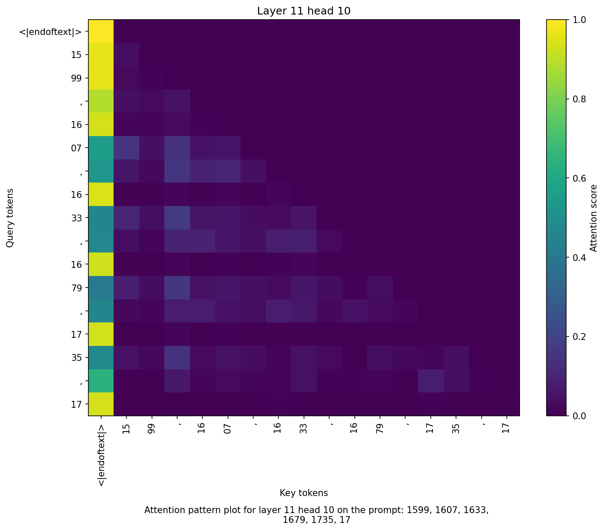

An interesting observation on the attention patterns generated by the new prompt is that the attention heads in later layers, like l9.h1, do not attend to the XX token and instead attend to the thousands and hundreds place tokens. This is a surprising find since we hypothesized in week two that the later attention layers are the ones which contribute information about the XX token to the MLPs. Furthermore, note that these important attention heads that we identified in week two are still necessary in the circuit computing this task, confirmed via path patching.>

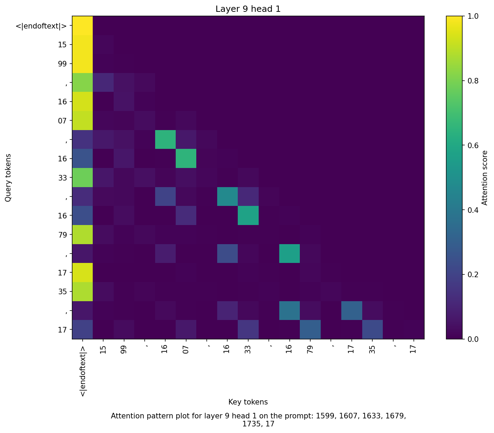

Why would these attention heads' roles in the circuit suddenly change? Here we detail one possible explanation. Our previous prompt was formatted in such a way that predicting the correct output relied only on understanding XX, since the natural language setting made it clear that it was a greater than task. Our new prompt format requires the model to both recognize that the output should demonstrate greater than, and then compute it. This explains why these later heads are attending to the thousands and hundreds places: the model is incorporating the context of the prompt to recognize that it is being asked to compute greater than.

A close look at earlier attention layers reveals that layer two strongly attends to the XX token of each of the years in the sequence. Thus, the XX information is not absent in this circuit. Then, it is likely that our initial hypothesis that attention heads like l9.h1 was not entirely correct, and these heads are not as specialized to attending to the XX token as we first anticipated. Instead, it is likely just a component which processes year information into the residual stream to prepare the MLPs to complete the computation. The precise role of these heads is still unconfirmed and up to interpretation.

That concludes my first cleanly reproduced interpretability paper. I learned a number of new techniques from path patching to ablation strategies, and it was a great experience overall. If I had more time, I'd investigate further the computational pathways that matter for the circuit and maybe probe into the earlier layers to try and understand how basic information unrelated to greater than is propagated through the model. For my current future projects, I'm currently experimenting with depth-recurrent transformers for the OpenAI parameter golf challenge with a couple of friends here at Dartmouth. All of my updates will be posted to my blog.

github repo: https://github.com/benjaminW2025/greater-than-cap
email: benjaminwang2025@gmail.com